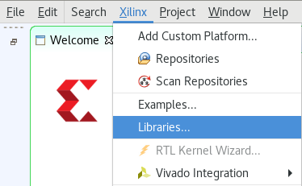
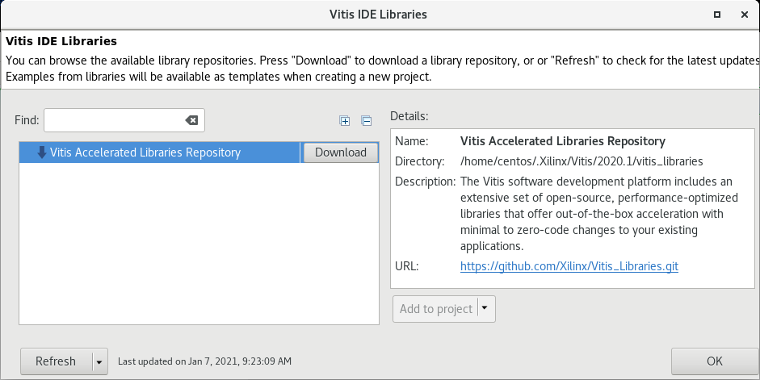
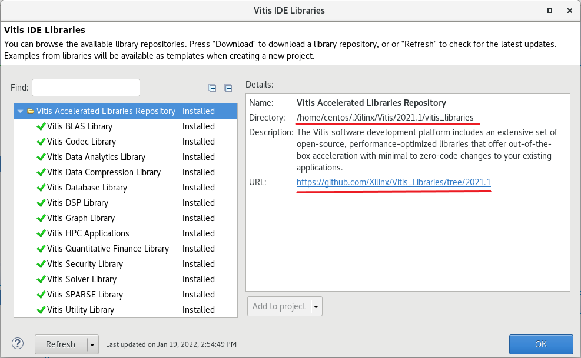
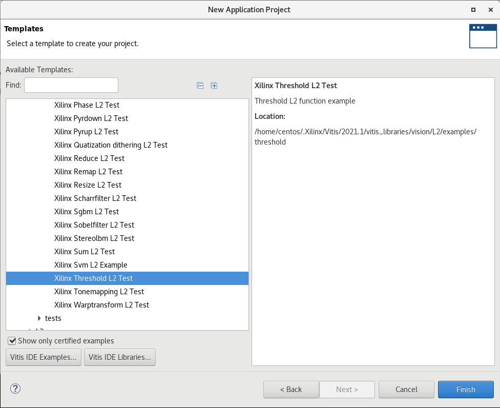
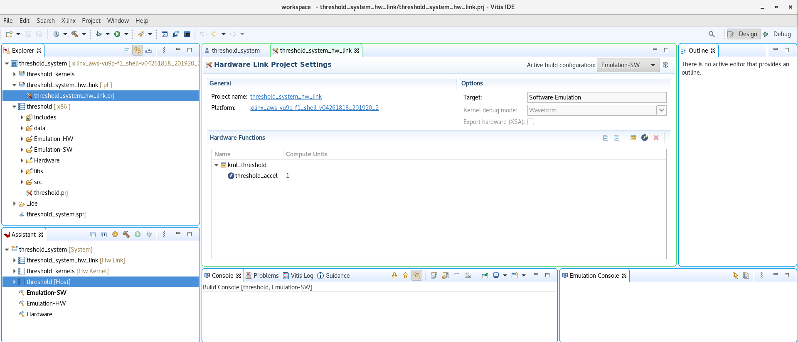
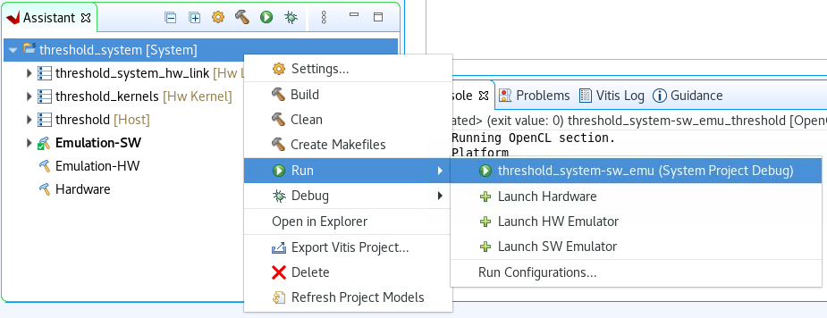

# Getting Started with Vitis Accelerated Libraries in the GUI

This guide will show you how to install, configure and use the [Vitis Accelerated Libraries](https://github.com/Xilinx/Vitis_Libraries) from Vitis GUI in AWS F1 instances.

This guide is part of the 2022 XACC winter school.

## Objectives

After completing this guide, you will be able to:

* Install the Vitis Accelerated Libraries
* Configure the Libraries for AWS F1
* Build a simple example

## Steps

### Install OS packages

First we need to install some packages, open a terminal and run

```sh
sudo yum install opencv opencv-core opencv-devel opencv-python libxml2 libxml2-devel -y
```

### Install Vitis Accelerated Libraries

Since Vitis 2020.1 the[Vitis Accelerated Libraries](https://github.com/Xilinx/Vitis_Libraries) can be installed directly from the GUI.

1. In Vitis GUI click **Xilinx > Libraries...**

   

1. Click **Download** button to get a local copy of the GitHub repository

   

1. After a few seconds the libraries are installed. Note the branch used and the local directory where the libraries are installed

   

1. Click **OK** to finish

### Edit local repository

We need to make a few editions in the local repository to use the libraries in AWS F1.

1. Open a new terminal

1. Open `xf_headers.hpp` to edit using Visual Code Studio

   ```sh
   gedit ~/.Xilinx/Vitis/2021.1/vitis_libraries/vision/L1/include/common/xf_headers.hpp &
   ```

1. Comment line 26 in the file `xf_headers.hpp`

   ```C
   //#include "opencv2/imgcodecs/imgcodecs.hpp"
   ```

1. Save the file 

1. Go back to the terminal and open `library.json` using Visual Code Studio

   ```sh
   gedit ~/.Xilinx/Vitis/2021.1/vitis_libraries/vision/library.json &
   ```

1. In the `library.json` file, replace from line 10 to 30 with the following

   ```json
   "host": {
   "compiler": {
           "includepaths": [
               "LIB_DIR/ext/xcl2/",
               "LIB_DIR/L1/include",
               "/usr/include/opencv"
           ]
       },
       "linker" : {
           "libraries" : [
               "xml2",
               "opencv_core",
               "opencv_imgproc",
               "opencv_features2d",
               "opencv_flann",
               "opencv_video",
               "opencv_calib3d",
               "opencv_highgui"
           ]
       }
   }
   ```

   We have added `/usr/include/opencv` in the `includepaths`. We have also removed `opencv_videoio` and `opencv_imgcodecs` and include `xml2` in `libraries`

1. Save the file

1. You can check the edited files [here](src/libs_config/)

### Create a Vitis application using the Library

1. In Vitis GUI select *Create Application Project*

1. Select *AWS F1 platform* and click *Next >*

1. In the Application Project name use: *threshold* and click *Next >*

1. Expand *Vitis Vision Library > L2 > examples* and select **Xilinx Threshold L2 Test**
    
   

   Note that you can also use the *Find* bar to search

   Note, you can uncheck *Show only certified examples* for more examples. However, it is not guaranteed that those examples will work

1. Click *Finish*

1. Explore the project and notice that source code and Hardware functions are automatically included
    
   

1. Build *Emulation-SW*

1. Run *Emulation-SW* by using `Run > Run Configurations...`
   
   

1. The Console output will be similar to:

   ```console
   INFO: Running OpenCL section.
   Found Platform
   Platform Name: Xilinx
   XCLBIN File Name: krnl_threshold
   INFO: Importing ../krnl_threshold.xclbin
   Loading: '../krnl_threshold.xclbin'
   138.929ms
       Minimum error in intensity = 0
       Maximum error in intensity = 0
       Percentage of pixels above error threshold = 0
   ```

1. You can explore the output images in the folder `Emulation-SW/threshold_system-sw_emu_threshold/`. You can open this folder in a terminal by running

    ```sh
    nautilus ~/workspace/threshold/Emulation-SW/threshold_system-sw_emu_threshold/
    ```

---------------------------------------
<p align="center">Copyright&copy; 2022 Xilinx</p>