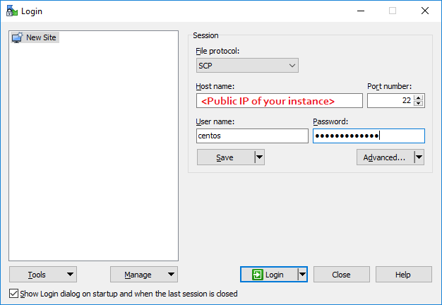
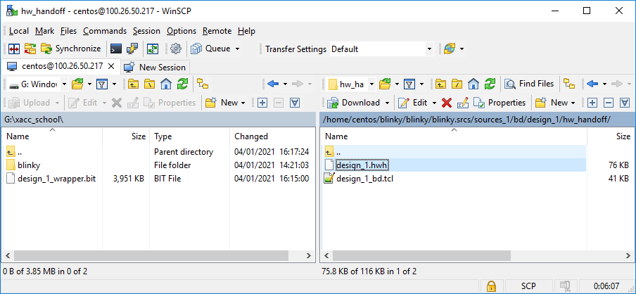

# WinSCP (Windows)

If you are using Windows, you can use [WinSCP](https://winscp.net/) to transfer files to/from your AWS instance.

* Install WinSCP
* Open WinSCP and use the IP address of the AWS instance and log in details to connect:

* You can then transfer files to a local folder on your computer

---------------------------------------

Copyright&copy; 2022 Xilinx
